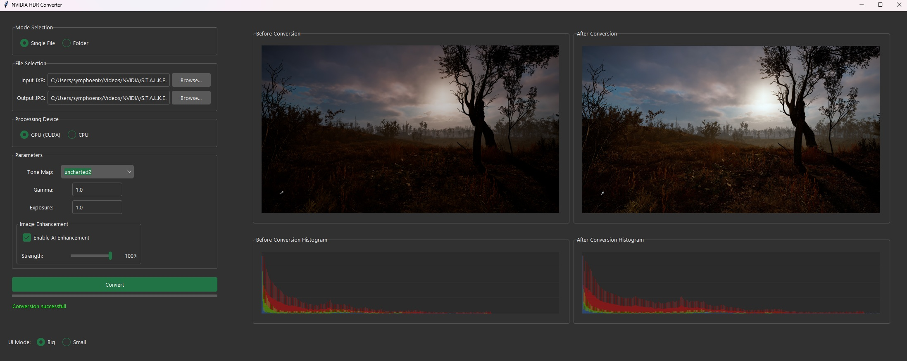

# NVIDIA HDR Converter GUI
Convert NVIDIA HDR screenshots (JXR format) to JPEG with advanced AI enhancement and tone mapping.

<p align="center">
  
</p>

## Features

### Core Functionality
- Convert NVIDIA JXR (HDR) screenshots to JPEG format
- Advanced HDR tone mapping with multiple algorithms
- AI-powered color enhancement using deep learning models
- Batch processing support
- Live preview with histogram visualization

### AI Color Enhancement
- Neural network-based color correction using VGG16, ResNet34, and DenseNet121
- Edge preservation and enhancement using CBAM attention
- Adaptive color balancing
- Intelligent contrast adjustment
- Natural color preservation

### Supported Tone Mapping Algorithms
- **Adaptive** (Default) - Automatically selects the best algorithm based on image content
- **Hable**
- **Reinhard**
- **Filmic**
- **ACES**
- **Uncharted 2**

### User Interface
- Modern, dark-themed GUI
- Real-time preview with before/after comparison
- Color histogram visualization
- Progress tracking for batch operations
- Customizable enhancement parameters

## Requirements

### Python Dependencies
```txt
torch==2.5.1
torchvision==0.16.1
Pillow==10.2.0
numpy==1.26.4
matplotlib==3.9.3
imagecodecs==2024.9.22
TKinterModernThemes==1.10.4
```

## Installation

1. Clone the repository:
   ```bash
   git clone https://github.com/5ymph0en1x/NVIDIA-HDR-Converter-GUI.git
   cd NVIDIA-HDR-Converter-GUI
   ```

2. Install Python dependencies:
   ```bash
   pip install -r requirements.txt
   ```

3. Run NHC.py
   ```bash
   python NHC.py
   ```

## Usage

### Single File Conversion
1. Launch the application
2. Select "Single File" mode
3. Choose input JXR file
4. Select output JPEG location
5. Adjust parameters as needed
6. Click "Convert"

### Batch Processing
1. Launch the application
2. Select "Folder" mode
3. Choose folder containing JXR files
4. Adjust parameters as needed
5. Click "Convert"

> **Note**: Converted files will be saved in a "Converted_JPGs" subfolder

### Parameters
- **Tone Map**: Select HDR tone mapping algorithm
- **Gamma**: Adjust gamma correction
- **Exposure**: Control exposure adjustment
- **AI Enhancement**: Toggle AI-powered enhancement
- **Edge Strength**: Adjust edge enhancement intensity

## Technical Details

### AI Architecture
- Ensemble of VGG16, ResNet34, and DenseNet121 for feature extraction
- Convolutional Block Attention Module (CBAM) for spatial and channel attention
- Edge enhancement block with Sobel filters
- Adaptive color balancing with preservation controls
- Multi-scale feature fusion

### Performance Optimization
- Automatic CPU/GPU detection and switching
- Memory-efficient tensor operations
- Multi-threaded batch processing
- Progressive image loading
- Half-precision (FP16) support for GPU processing

## Acknowledgments

- Uses PyTorch pretrained models (VGG16, ResNet34, DenseNet121)
- GUI theme based on TKinterModernThemes
- JXR decoding powered by imagecodecs library
