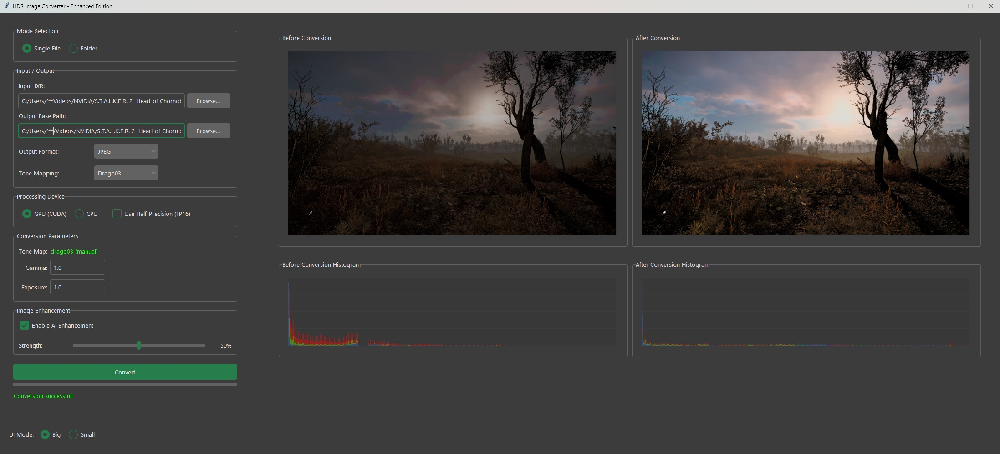

# NVIDIA HDR Converter GUI

Convert NVIDIA HDR screenshots (JXR format) to JPEG with advanced AI enhancement and intelligent tone mapping.

<p align="center">
  
</p>

## Features

### Core Functionality
- **Convert NVIDIA JXR (HDR)** screenshots to JPEG format
- **Intelligent HDR tone mapping** with automatic algorithm selection
- **AI-powered color enhancement** using ensemble deep learning models
- **Batch processing** support for folders
- **Live preview** with before/after comparison and histogram visualization
- **HDR metadata extraction** from JXR files for optimal processing

### AI Color Enhancement
- **Multi-model ensemble** using VGG16, ResNet34, and DenseNet121
- **CBAM attention mechanism** for spatial and channel-wise feature enhancement
- **Perceptual color preservation** during tone mapping
- **Edge enhancement** with Sobel filters and adaptive strength control
- **Color balance optimization** across shadows, midtones, and highlights
- **Half-precision (FP16)** support for memory-efficient GPU processing

### Advanced Tone Mapping Algorithms
- **Perceptual** - Advanced tone mapping preserving local contrast and color relationships
- **Adaptive** - Intelligent blending of multiple operators based on image regions
- **Mantiuk06** - Contrast-based tone mapping with local adaptation
- **Drago03** - Logarithmic tone mapping optimized for extreme dynamic ranges
- **Hable** - Filmic tone mapping curve (Uncharted 2)
- **ACES** - Academy Color Encoding System RRT+ODT
- **Reinhard** - Extended Reinhard with white point adaptation
- **Filmic** - Cinematic tone mapping
- **Uncharted2** - Game-optimized tone mapping

### Intelligent Processing
- **Automatic tone mapping selection** based on comprehensive image analysis
- **Scene classification** (high-key, low-key, extreme highlights detection)
- **Dynamic range analysis** with histogram-based optimization
- **Local contrast preservation** and enhancement
- **Color saturation analysis** and adaptive correction

### User Interface
- **Modern dark-themed GUI** with TKinterModernThemes
- **Dual preview modes** (Big/Small) with resizable interface
- **Real-time histogram visualization** with RGB channel analysis
- **Progress tracking** for batch operations
- **Device switching** (GPU/CPU) with live performance monitoring
- **Parameter adjustment** with live preview updates

## Requirements

### System Requirements
- **Python 3.8+**
- **NVIDIA GPU** (recommended) with CUDA support
- **4GB+ RAM** (8GB+ recommended for large images)

### Python Dependencies
```txt
torch>=2.0.0
torchvision>=0.15.0
Pillow==10.2.0
numpy==1.26.4
matplotlib==3.9.3
imagecodecs==2024.9.22
TKinterModernThemes==1.10.4
```

**Install PyTorch:** Visit https://pytorch.org/ for CUDA-compatible installation

## Installation

1. **Clone the repository:**
   ```bash
   git clone https://github.com/5ymph0en1x/NVIDIA-HDR-Converter-GUI.git
   cd NVIDIA-HDR-Converter-GUI
   ```

2. **Install dependencies:**
   ```bash
   pip install -r requirements.txt
   ```

3. **Run the application:**
   ```bash
   python NHC.py
   ```

## Usage

### Single File Conversion
1. Launch the application
2. Select **"Single File"** mode
3. Browse and select input JXR file
4. Choose output JPEG location
5. Adjust parameters (gamma, exposure, enhancement strength)
6. Click **"Convert"**

### Batch Processing
1. Select **"Folder"** mode
2. Choose folder containing JXR files
3. Configure enhancement parameters
4. Click **"Convert"**

> **Note:** Converted files are saved in a `Converted_JPGs` subfolder with automatic naming

### Parameter Configuration

#### Basic Parameters
- **Tone Map**: Displays auto-detected optimal algorithm
- **Gamma**: Pre-gamma correction (0.1-3.0, default: 1.0)
- **Exposure**: Auto-exposure adjustment (0.1-3.0, default: 1.0)

#### AI Enhancement Controls
- **Enable AI Enhancement**: Toggle neural network-based color correction
- **Strength**: Edge enhancement intensity (0-100%, default: 50%)

#### Device Settings
- **GPU/CPU Selection**: Automatic CUDA detection with fallback
- **Half-Precision Toggle**: Enable FP16 for memory efficiency (GPU only)

### Interface Modes
- **Big Mode**: 2200×850 window with 720×406 previews
- **Small Mode**: 1760×840 window with 512×288 previews

## Technical Architecture

### HDR Processing Pipeline
1. **JXR Decoding** with metadata extraction
2. **Image Analysis** for optimal tone mapping selection
3. **Tone Mapping** using selected algorithm
4. **AI Enhancement** (optional) with color correction
5. **Edge Enhancement** (optional) with adaptive filtering
6. **sRGB Conversion** and JPEG encoding

### AI Enhancement Architecture
```
Input → VGG16 Features    ↘
     → ResNet34 Features  → Feature Fusion → CBAM Attention → Color Transform → Output
     → DenseNet Features  ↗
```

### Key Components
- **HDRMetadata**: Extracts luminance and color space information
- **AdvancedToneMapper**: Multi-algorithm tone mapping with automatic selection
- **PerceptualColorPreserver**: CIE LAB color space preservation
- **ColorCorrectionNet**: Ensemble deep learning model
- **EdgeEnhancementBlock**: Sobel-based edge detection and enhancement
- **DeviceManager**: GPU/CPU switching with memory optimization

### Performance Optimizations
- **Memory-efficient tensor operations** with automatic cleanup
- **Multi-threaded processing** for batch operations
- **Progressive image loading** for large files
- **CUDA memory management** with automatic cache clearing
- **Half-precision support** reducing memory usage by 50%

### Image Analysis Metrics
- **Dynamic range analysis** (min/max/mean luminance)
- **Zone system analysis** (shadow/midtone/highlight distribution)
- **Local contrast measurement** with variance analysis
- **Color saturation evaluation** across channels
- **Scene classification** (high-key/low-key/extreme highlights)

## Supported Formats

### Input
- **JXR files** (JPEG XR) from NVIDIA HDR screenshots
- **HDR metadata** automatic extraction and utilization

### Output
- **JPEG** with optimized quality settings (95% quality, optimized compression)

## Logging and Debugging
- **Comprehensive logging** to `hdr_converter.log`
- **Real-time status updates** in GUI
- **Error handling** with detailed messages
- **Performance metrics** logging

## Known Limitations
- **JXR format only** - other HDR formats not supported
- **NVIDIA screenshots** - optimized for NVIDIA HDR capture format
- **Memory requirements** - large images may require significant RAM

## Troubleshooting

### Common Issues
- **"imagecodecs version compatibility"**: Update imagecodecs to latest version
- **CUDA out of memory**: Enable FP16 mode or switch to CPU processing
- **JXR decode failure**: Ensure file is valid NVIDIA HDR screenshot

### Performance Tips
- **Use GPU mode** for faster processing
- **Enable FP16** to reduce memory usage
- **Close other applications** when processing large batches
- **Use Small mode** for lower memory usage

## Acknowledgments
- **PyTorch** pretrained models (VGG16, ResNet34, DenseNet121)
- **TKinterModernThemes** for modern GUI design
- **imagecodecs** for JXR decoding support
- **NVIDIA** for HDR screenshot format documentation

## License
This project is open source. Please check the license file for details.

---

**Version**: Enhanced Edition with AI-powered processing and intelligent tone mapping
